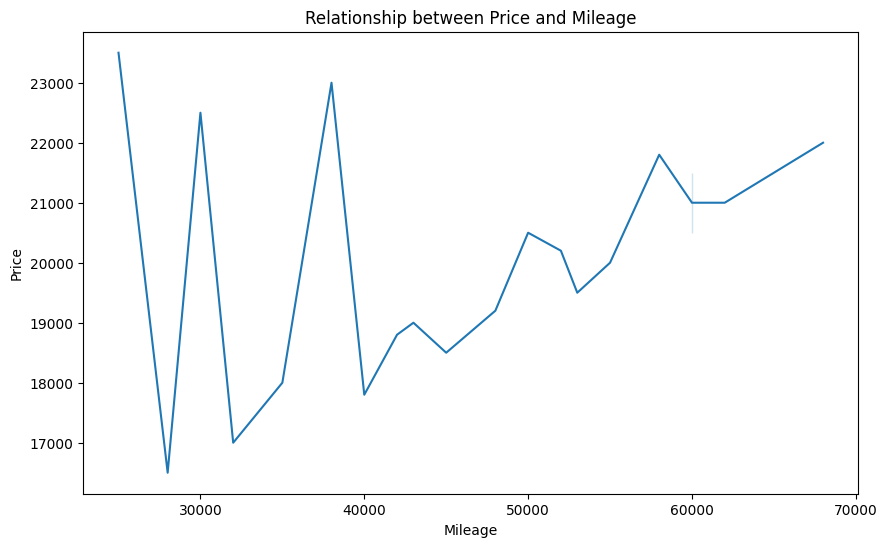
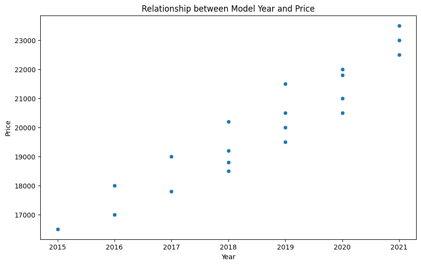
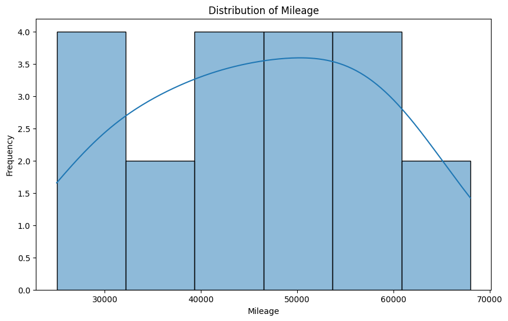
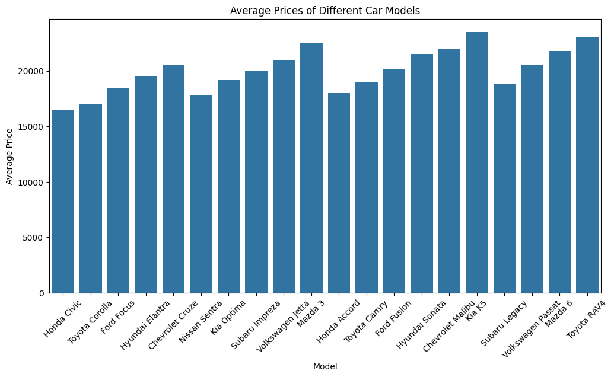
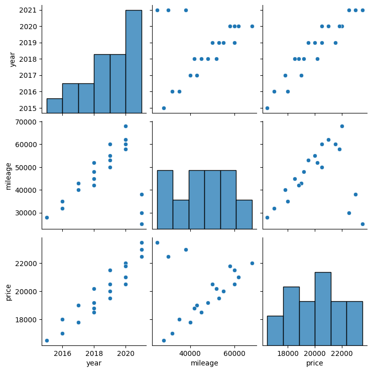
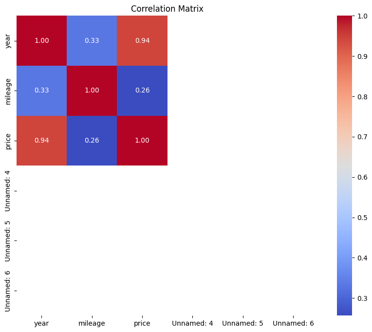
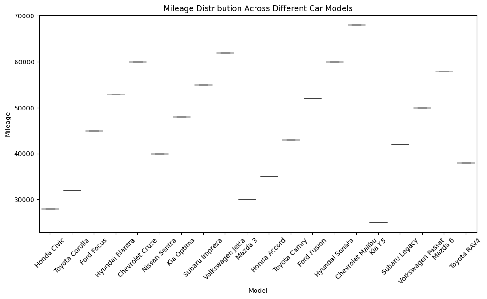
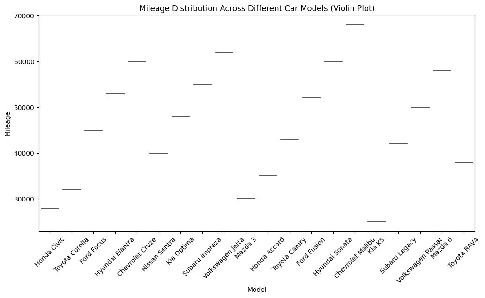
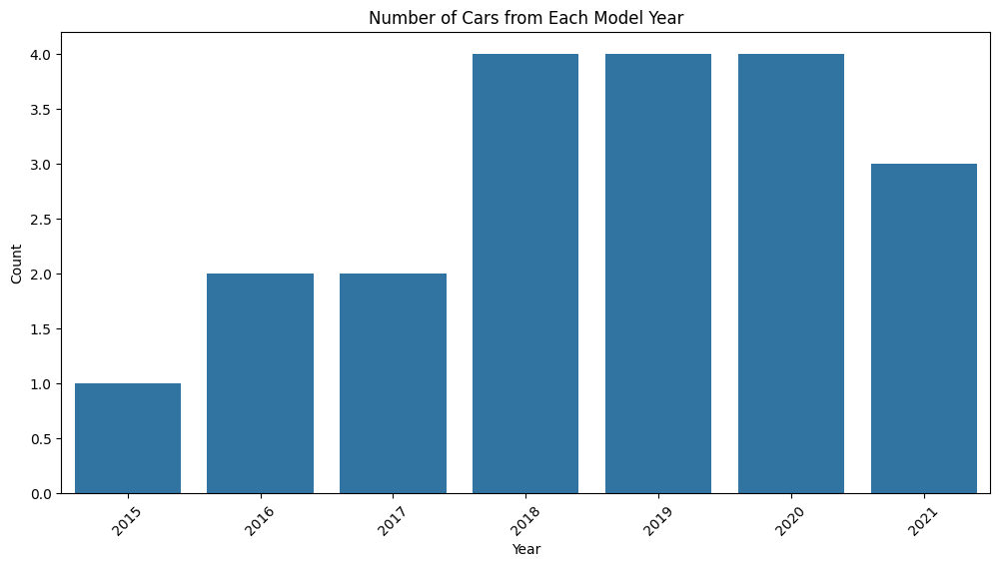

# DV Lab 05

### Import Libraries and Dataset
- Pandas
- Seaborn
- Matplotlib


```python
import pandas as pd
import seaborn as sns
import matplotlib.pyplot as plt
```


##### Question: Does the price of the cars tend to increase with mileage?
##### Marking Criteria: The chart should display a line for 'price' on the y-axis and 'mileage' on the x-axis. Consider adding a title and labels for the axes.


```python
# Load dataset
df = pd.read_csv("cars_data.csv")
df.head()

```


    ---------------------------------------------------------------------------

    NameError                                 Traceback (most recent call last)

    Cell In[2], line 2
          1 # Load dataset
    ----> 2 df = pd.read_csv("cars_data.csv")
          3 df.head()


    NameError: name 'pd' is not defined


```python
plt.figure(figsize=(10, 6))
sns.lineplot(x='mileage', y='price', data=df)
plt.title('Relationship between Price and Mileage')
plt.xlabel('Mileage')
plt.ylabel('Price')
plt.show()
```


    

    


##### Question: Is there a relationship between the car's model year and its price?
##### Marking Criteria: The chart should display points for each car, with 'year' on the x-axis and 'price' on they-axis. Include a title and labels for the axes.


```python
plt.figure(figsize=(10, 6))
sns.scatterplot(x='year', y='price', data=df)
plt.title('Relationship between Model Year and Price')
plt.xlabel('Year')
plt.ylabel('Price')
plt.show()
```


    

    


##### Question: How is the mileage of the cars distributed?
##### Marking Criteria: The chart should represent the frequency of each mileage value on the x-axis. You can use a 'histplot' or 'displot' function.


```python
plt.figure(figsize=(10, 6))
sns.histplot(df['mileage'], kde=True)
plt.title('Distribution of Mileage')
plt.xlabel('Mileage')
plt.ylabel('Frequency')
plt.show()
```


    

    


##### Question: What are the average prices of different car models?
##### Marking Criteria: The chart should have bars representing the average 'price' for each unique 'model' on the x-axis. Consider using a 'barplot' function.


```python
plt.figure(figsize=(12, 6))
sns.barplot(x='model', y='price', data=df)
plt.title('Average Prices of Different Car Models')
plt.xlabel('Model')
plt.ylabel('Average Price')
plt.xticks(rotation=45)
plt.show()
```


    

    


##### Question: How do 'year' and 'mileage' relate to each other?
##### Marking Criteria: The chart should display a distribution plot for each pair of numeric variables from the dataset (year vs mileage, price vs mileage, etc.). You can use a 'pairplot' function.


```python
sns.pairplot(df[['year', 'mileage', 'price']])
plt.show()
```

    /Library/Frameworks/Python.framework/Versions/3.11/lib/python3.11/site-packages/seaborn/axisgrid.py:123: UserWarning: The figure layout has changed to tight
      self._figure.tight_layout(*args, **kwargs)


    

    


##### Question: How correlated are the numeric variables in the dataset?
##### Marking Criteria: The chart should represent a heatmap where the intensity of each square reflects the correlation between two variables. You can use a 'heatmap' function.


```python
numeric_df = df.select_dtypes(include=['int64', 'float64'])
```


```python
plt.figure(figsize=(10, 8))
sns.heatmap(numeric_df.corr(), annot=True, cmap='coolwarm', fmt=".2f")
plt.title('Correlation Matrix')
plt.show()
```


    

    


##### Question: How does the mileage distribution differ between different car models?
##### Marking Criteria: The chart should display boxplots for 'mileage' across different models


```python
plt.figure(figsize=(12, 6))
sns.boxplot(x='model', y='mileage', data=df)
plt.title('Mileage Distribution Across Different Car Models')
plt.xlabel('Model')
plt.ylabel('Mileage')
plt.xticks(rotation=45)
plt.show()
```


    

    


##### Question: Similar to the box plot, how does the mileage distribution differ between car models, but with a clearer view of the data spread within each category?
##### Marking Criteria: The chart should display violin plots for 'mileage' across different 'model' categories. Violin plots combine features of box plots and density plots, providing a more detailed view of the distribution.


```python
plt.figure(figsize=(12, 6))
sns.violinplot(x='model', y='mileage', data=df)
plt.title('Mileage Distribution Across Different Car Models (Violin Plot)')
plt.xlabel('Model')
plt.ylabel('Mileage')
plt.xticks(rotation=45)
plt.show()
```


    

    


##### Question: How many cars from each model year are present in the dataset?
##### Marking Criteria: The chart should display bars representing the count of cars for each unique value in the 'year' variable. You can use a 'countplot' function.


```python
plt.figure(figsize=(12, 6))
sns.countplot(x='year', data=df)
plt.title('Number of Cars from Each Model Year')
plt.xlabel('Year')
plt.ylabel('Count')
plt.xticks(rotation=45)
plt.show()
```


    

    


```python

```
